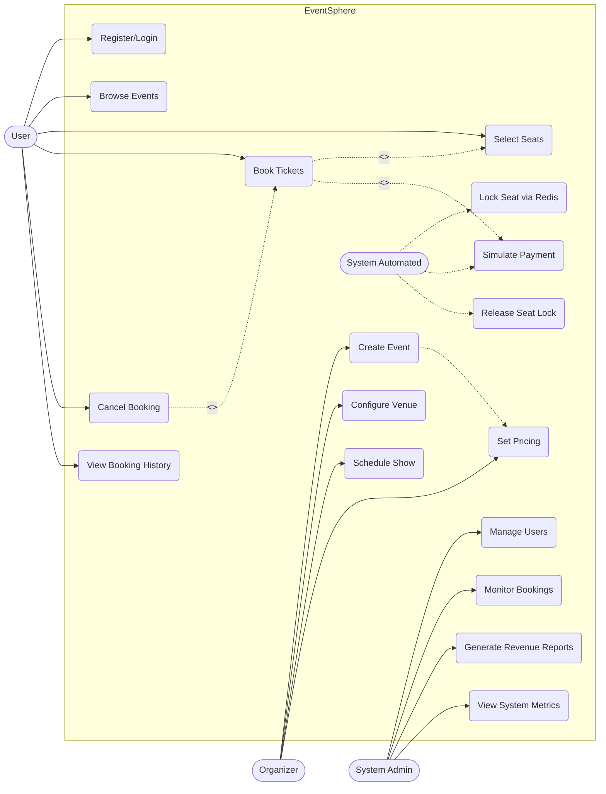
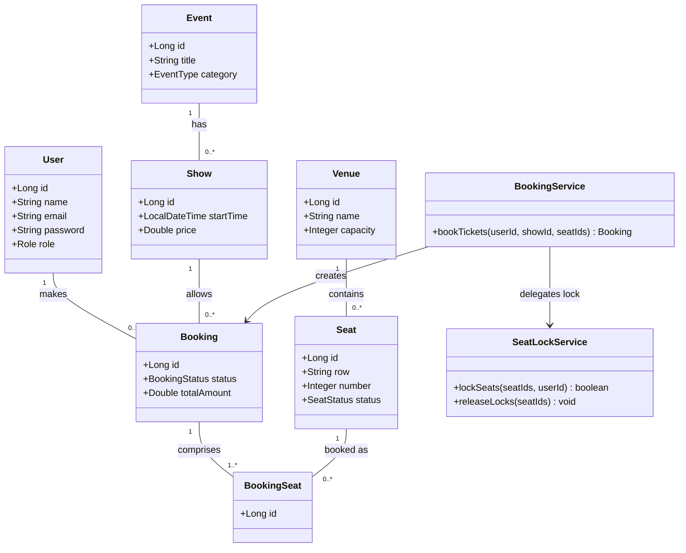
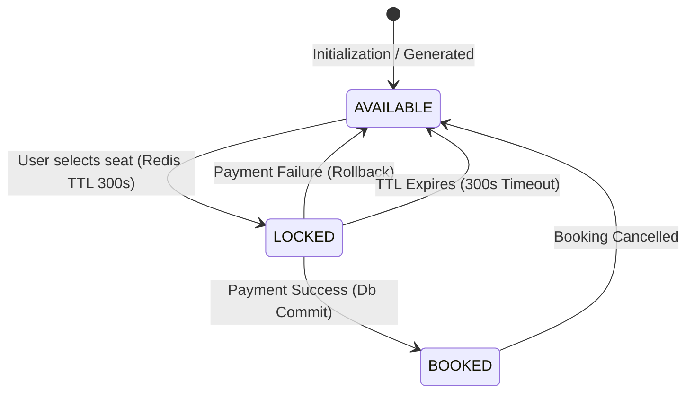
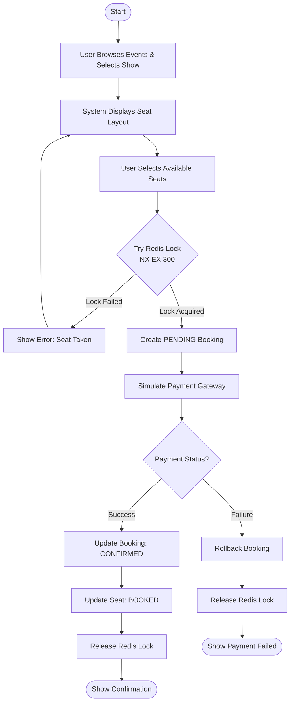
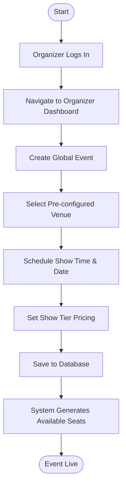

# UE23CS352B - Object Oriented Analysis & Design
## Mini Project Report
**EventSphere – Scalable Event Booking Platform (BMS)**

**Submitted by:**  
**Team Members**  
- JEEVAN K (PES2UG23CS240)
- JEEVAN R (PES2UG23CS241)
- K HARSHIT (PES2UG23CS246)
- K V ARYAN URS (PES2UG23CS249)

**Semester 6 – Section D**  
**Prof Sowmya**  
**January - May 2026**

**DEPARTMENT OF COMPUTER SCIENCE AND ENGINEERING**  
**FACULTY OF ENGINEERING**  
**PES UNIVERSITY**  
*(Established under Karnataka Act No. 16 of 2013)*  
100ft Ring Road, Bengaluru – 560 085, Karnataka, India

---

## 1. Problem Statement
Large-scale events such as movies, sports matches, and concerts attract thousands of simultaneous ticket buyers, creating severe challenges in seat reservation, concurrency control, and payment processing. Existing systems frequently suffer from double-booking, race conditions under peak load, and poor transaction safety. A centralized, scalable booking platform is required that can handle high-concurrency seat selection, enforce strict data consistency, and provide a seamless experience for users, organizers, and administrators alike.

EventSphere (BMS — Booking Management System) is a multi-event booking platform built with Spring Boot, Thymeleaf, HTMX, H2/PostgreSQL, and Redis. It supports movies, concerts, and sports events with booking, payment simulation, admin management, reporting, and Redis-based caching and seat locking.

---

## 2. Key Features

### User Features
- Browse and discover events across multiple categories: Movies, Sports, and Concerts.
- View detailed event and show information including venue, timing, and seat pricing.
- Interactive seat selection with real-time availability visualization (available, locked, booked).
- Book tickets with a transactional workflow tied to payment simulation.
- Cancel bookings and view complete booking history.

### Organizer Features
- Create and manage events with configurable categories and descriptions.
- Configure venues and define seat layouts dynamically.
- Schedule shows and set per-seat pricing tiers.

### Admin Features
- Unified admin dashboard for booking statistics, revenue analytics, and system monitoring.
- User management: view, suspend, and manage all registered accounts.
- Spring Boot Actuator integration for health, metrics, and cache monitoring.

---

## 3. System Highlights
- **Concurrency-safe seat locking** using Redis distributed locks (`SET seat:A12 user123 NX EX 300`), preventing double-booking under high traffic.
- **Hybrid authentication**: session-based auth for web UI, JWT stored in HttpOnly cookie (`BMS_TOKEN`) for REST APIs.
- **Transactional payment simulation** with automatic booking rollback and seat lock release on payment failure.
- **Docker + Docker Compose** deployment with GitHub Actions CI/CD pipeline.
- Demo data seeded automatically on startup; H2 in-memory DB for development, PostgreSQL for production.

---

## 4. Models
The system is built around the following core domain entities:
- **User** — Registered users with roles (USER, ORGANIZER, ADMIN), credentials stored securely with Spring Security password encoding.
- **Event** — Represents a bookable event (movie, sports match, concert) with category, description, and organizer reference.
- **Venue** — Physical location of an event; contains seat layout configuration and total capacity.
- **Show** — A specific scheduled instance of an Event at a Venue, with start time and pricing.
- **Seat** — Individual seat within a Venue, identified by row and number, with a status (AVAILABLE, LOCKED, BOOKED).
- **Booking** — Records a confirmed ticket purchase by a User for a specific Show, linked to payment status.
- **BookingSeat** — Join entity mapping individual Seats to a Booking, supporting multi-seat reservations in a single transaction.
- **Payment (simulated)** — Models the payment workflow with simulated delays and success/failure outcomes, linked to a Booking.

---

## 5. Use Case Diagram
The Use Case Diagram below illustrates the interactions between the three primary actors — User, Organizer, and System Admin — and the major use cases of the EventSphere platform.

**Key actor-to-use-case mappings:**
- **User**: Register/Login, Browse Events, Select Seats, Book Tickets, Cancel Booking, View Booking History.
- **Organizer**: Create Event, Configure Venue, Schedule Show, Set Pricing (extends Manage Event).
- **Admin**: Manage Users, Monitor Bookings, Generate Revenue Reports, View System Metrics.
- **System (automated)**: Lock Seat via Redis, Simulate Payment, Release Seat Lock on Failure, Seed Demo Data.

**Notable UML relationships:**
- `Book Tickets <<include>> Select Seats` — seat selection is mandatory before booking.
- `Book Tickets <<include>> Simulate Payment` — payment is always triggered as part of booking.
- `Cancel Booking <<extend>> Book Tickets` — cancellation is an optional extension of the booking flow.

---

## 6. Class Diagram
The Class Diagram depicts the object-oriented structure of EventSphere, showing all major entities, their attributes, methods, and inter-class relationships including associations, compositions, and the service/repository layers.

**Core class relationships:**
- `User (1) — (0..*) Booking`: A user can have multiple bookings across different shows.
- `Event (1) — (0..*) Show`: An event can have multiple scheduled shows.
- `Venue (1) — (0..*) Seat`: A venue contains many seats, each with a row/number and status enum.
- `Show (1) — (0..*) Booking`: A show can be booked by multiple users.
- `Booking (1) — (1..*) BookingSeat`: Each booking covers one or more specific seats (composition).
- `BookingSeat` is the join entity between Booking and Seat, enabling multi-seat reservations per transaction.

**Key service classes and patterns:**
- `BookingService`: Orchestrates seat locking (Redis), booking persistence, and payment simulation in a single `@Transactional` boundary.
- `EventService` / `ShowService`: Business logic for event and show management, including seat generation.
- `UserDetailsServiceImpl`: Implements Spring Security's UserDetailsService for authentication.

---

## 7. State Diagram
The State Diagram models the lifecycle of a Seat, which is the most critical stateful entity in the concurrency model of EventSphere.

**State transitions for a Seat:**
- **AVAILABLE (initial)**: Seat is open for selection by any user.
- **LOCKED**: A Redis distributed lock (TTL = 300 seconds) is acquired when a user selects the seat. No other user can book this seat during the lock window. If the booking is not completed before TTL expires, the seat reverts to `AVAILABLE` automatically.
- **BOOKED (final)**: Payment simulation succeeds, booking is persisted, and seat status is permanently set to `BOOKED`.
- **AVAILABLE (on failure)**: If payment simulation fails, the `@Transactional` method rolls back the booking record and the Redis lock is released, returning the seat to `AVAILABLE`.

Additionally, a `Booking` entity follows its own lifecycle: `PENDING` → `CONFIRMED` (on payment success) → `CANCELLED` (on user cancellation).

---

## 8. Activity Diagrams

### Ticket Booking Workflow
The primary Activity Diagram below illustrates the end-to-end Ticket Booking workflow, which is the central and most complex process in EventSphere.

### Event and Show Creation by Organizer
Secondary Activity Diagram representing the flow for an Organizer preparing a new event mapping.

---

## 9. Design Principles and Design Patterns

### MVC Architecture
Yes. EventSphere is structured using the Model-View-Controller pattern. The Controller layer (Spring MVC `@Controller` and `@RestController`) handles HTTP routing. The View layer is rendered by Thymeleaf templates with HTMX for dynamic updates. The Model layer consists of JPA entities managed by the Service and Repository layers.

### Design Principles
1. **Single Responsibility Principle (SRP):** Each class has exactly one concern. `BookingService` manages only the booking transaction lifecycle. `SeatLockService` handles only Redis seat lock acquisition and release. `EventService` deals only with event CRUD.
2. **Open/Closed Principle (OCP):** The Event entity is designed as an extensible base. New event categories can be added without modifying existing booking or discovery logic. Payment simulation is pluggable.
3. **Dependency Inversion Principle (DIP):** Spring Boot's IoC container manages all dependencies via constructor injection. Controllers depend on service interfaces, not concrete service classes.

### Design Patterns
1. **Repository Pattern:** All database access is abstracted behind Spring Data JPA repository interfaces, isolating persistence logic completely.
2. **Facade Pattern:** `BookingService` acts as a facade over the complexity of the booking transaction: it coordinates Redis, JDBC, PaymentService, and Seat updates behind a single `bookTickets()` method.
3. **Singleton Pattern:** Spring Boot automatically enforces the Singleton lifecycle for all beans.
4. **Factory Method Pattern:** Seat generation for a new venue is handled by a Factory-style routine in VenueService, generating Seat objects dynamically upon venue configuration.
5. **Strategy Pattern:** The payment processing logic is implemented as an interchangeable strategy via the `PaymentService` interface.

---

## 10. GitHub Repository
The complete source code is available at the following public repository:  
https://github.com/jeevan4476/bms

The repository contains the full Spring Boot backend (Java 21), Thymeleaf + HTMX frontend, Docker + Docker Compose configuration, GitHub Actions CI pipeline, and all project documentation.

---

## 11. Screenshots
*(To accurately reflect your local test execution, place screenshots within an `images/` directory inside this repository with the exact names below)*

### Admin Dashboard

### Home Page / Event Listing

### Seat Selection Page

### Booking Confirmation

---

## 12. Individual Contributions
The following table outlines each team member's responsibilities:

| Name | Module Worked On |
| :--- | :--- |
| **Jeevan K** PES2UG23CS240 | **Core Domain Modeling & Database Design** Designed JPA entities (User, Event, Venue, Booking, etc). Defined constraints, indexing strategy. Configured Spring Boot environments and health checks. |
| **Jeevan R** PES2UG23CS241 | **Frontend (Thymeleaf + HTMX) & Event Discovery** Designed Web templates. Integrated HTMX for dynamic partial rewrites. Implemented Event Discovery REST APIs and seat layout visuals. |
| **K Harshit** PES2UG23CS246 | **Design Patterns, Authentication & Security** Implemented hybrid auth (JWT HttpOnly + Session). Configured Spring Security 7. Validated OOAD principles and authored architectural diagrams. |
| **K V Aryan Urs** PES2UG23CS249 | **Booking Engine, Redis Concurrency & Admin** Built transactional Redis locking logic (`NX EX`). Developed admin reporting dashboards, actuator metrics, CI/CD pipeline, and Dockerization. |
